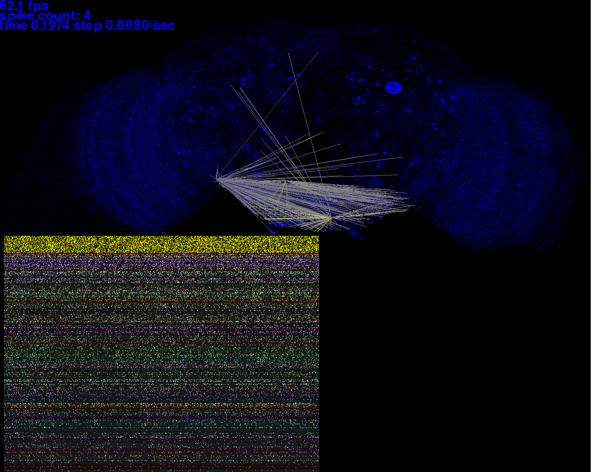
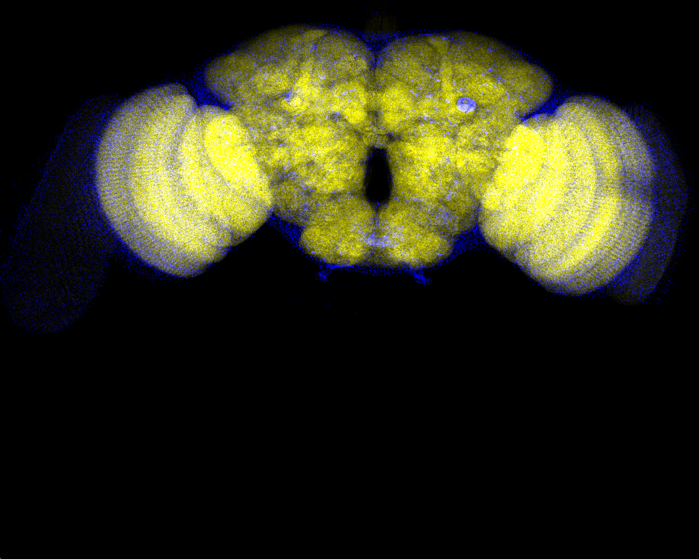
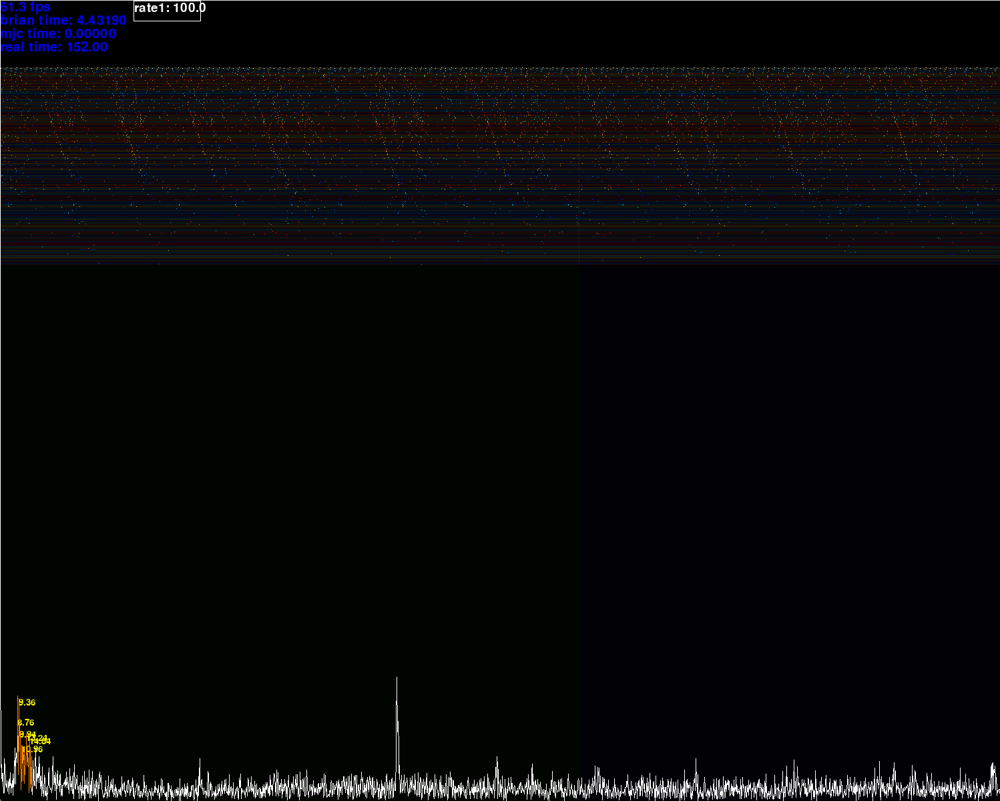
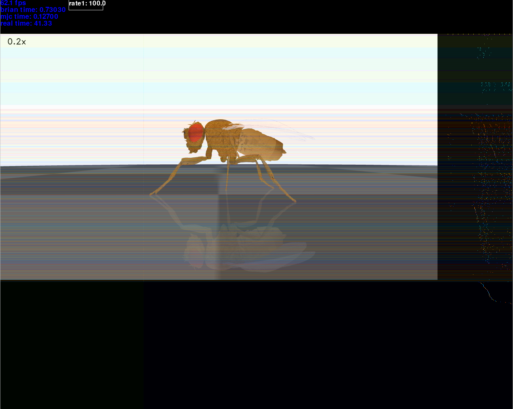

Repo for my experiments simulating fly brains. 

### Installation:
```
git clone https://github.com/mister-person/fly.git
cd fly
git clone https://github.com/NeLy-EPFL/flygym.git
```
download data folder from https://drive.google.com/file/d/1tUMLtXxt5gU1Lu3D9WTkaJC4-W5fnRLC/view?usp=sharing and put it in the project.
```
python -m venv venv #or python3.12 or wherever python 3.12 is
source venv/bin/activate
pip install -r requirements.txt
```

### Scripts that do interesting things:

`draw_spikes.py`

`draw_synapses.py`

`draw_neuron_classes.py`

`realtime.py`

`learn.py`

`gymtest.py`

### Some screenshots:





